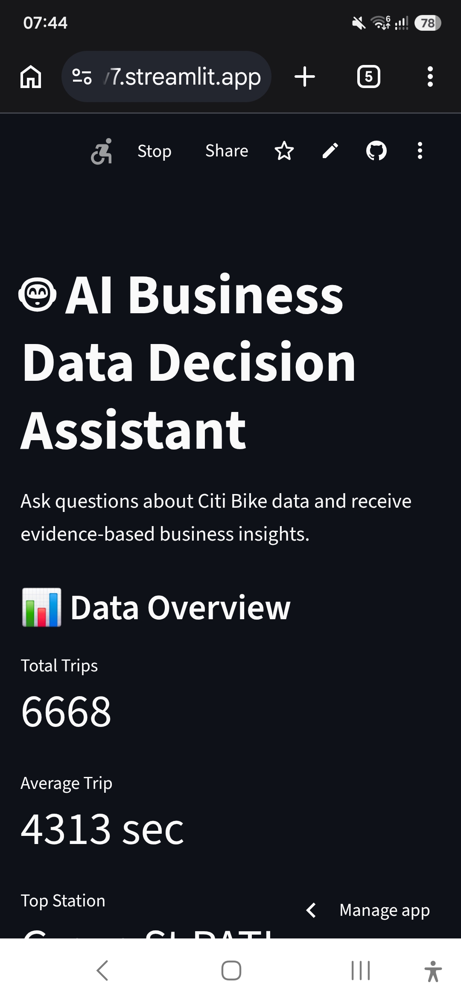
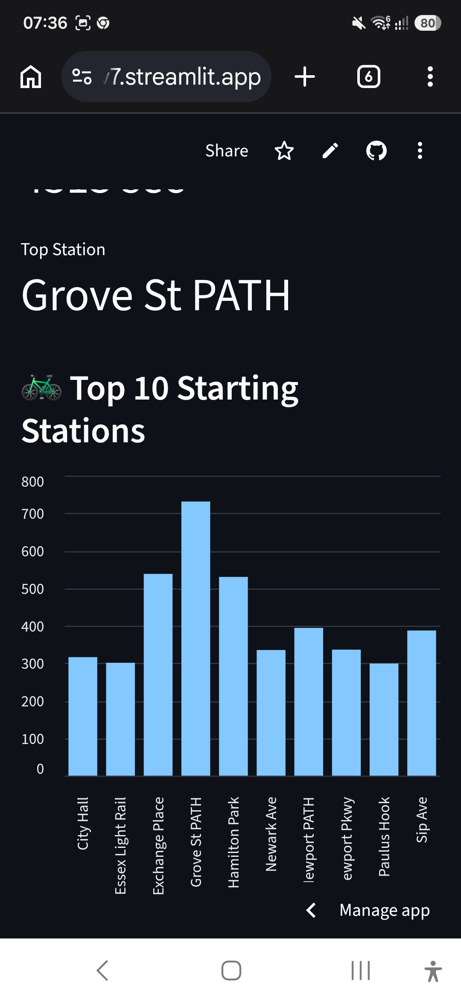
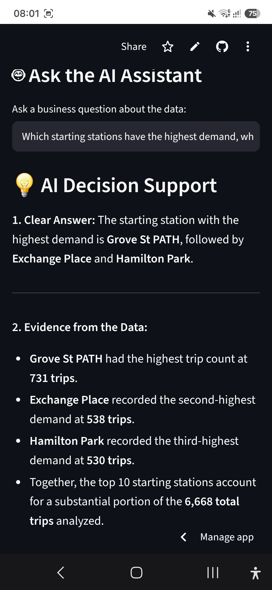

# 🤖 AI Business Data Decision Assistant

An AI-powered decision-support application that transforms Citi Bike trip data into actionable business insights using Python, Pandas, Google Gemini, and Streamlit.

## 🎯 Project Overview

Business data can contain valuable information, but raw tables are often difficult to interpret.

This project combines data analysis with generative AI to help users ask business questions in natural language and receive evidence-based insights and recommendations.

## 🧠 How It Works

User Question
↓
Streamlit Interface
↓
Python + Pandas
↓
Data Analysis
↓
Relevant Data Summary
↓
Google Gemini
↓
Business Insight + Recommendation

## 📊 Dataset

The project uses publicly available Citi Bike trip data.

The analysis includes information such as:

- Trip duration
- Start and end stations
- Trip start and end times
- User type
- Rider information

## 🚀 Features

- Natural-language business questions
- Data-driven station analysis
- Interactive Streamlit dashboard
- Top station visualization
- Gemini-powered business insights
- Evidence-based recommendations
- Secure API-key handling

## 🛠️ Technology Stack

- Python
- Pandas
- Google Gemini API
- Google GenAI Python SDK
- Streamlit
- GitHub
- Streamlit Community Cloud

## 🔐 Security

The Gemini API key is stored using Streamlit Secrets and is not included in the source code.

## 💡 Example Questions

- Which starting stations have the highest demand?
- What patterns can be observed in trip duration?
- Which locations may require additional operational attention?
- What business opportunities can be identified from the data?

- ## 📸 Application Screenshots

### 📊 Dashboard Overview

### 🚲 Top 10 Starting Stations

### 🤖 AI Decision Support

## 🍰 live demo

https://ai-business-data-decision-assistant-9npge8fe4w82t6sxghjbv7.streamlit.app/?

## google colab notebook

https://colab.research.google.com/drive/1VZ4pk-4H5TBg-aNouahEH5y2VzRva_1L

## 🌍 Future Applications

The same architecture can be adapted to other domains such as healthcare analytics, operational intelligence, and evidence-based decision support.

For example:

Healthcare data
→ Data analysis
→ AI interpretation
→ Evidence
→ Decision support

## 📌 Project Goal

This project demonstrates how generative AI can be combined with structured data analysis to support practical, evidence-based decision making.

**Author:** Dr Neha Malav  

**Focus:** AI • Data Analytics • Decision Support
